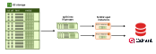

# Data Loading

vectorforge's loading pipeline streams pre-embedded parquet files from S3 or HuggingFace into vector stores like Qdrant. An embedding run typically produces many parquet files (one per chunk/slice) under a shared S3 prefix -- the loader reads all of them. It uses DuckDB for efficient remote parquet reads and async concurrency for parallel upserts.



Pre-embedded parquet files on S3 are split into N groups. Each group is assigned to an EC2 spot instance (via SkyPilot). Each instance streams its data through DuckDB and upserts into a shared Qdrant cluster. HNSW indexing is deferred for the entire load, then built in one pass at the end.

## Single-machine loading

For small-to-medium datasets, or when running on a single VM:

```bash
vectorforge-load configs/loader/my_dataset.yaml
```

### Configuration

Loader configs live in `configs/loader/` and have three sections:

```yaml
datasource:
  type: s3                          # s3 or huggingface
  s3_bucket: my-bucket
  s3_prefix: dataset/model
  payload_fields:                   # what ends up in the vector store payload
    text: text                      # payload key: parquet column name
    source: source

vectorstore:
  type: qdrant
  collection_name: my-collection
  url: ${QDRANT_URL}                # env var substitution with ${VAR}
  api_key: ${QDRANT_API_KEY}

loader:
  batch_size: 1000                  # points per upsert call
  prefetch_size: 100000             # rows per DuckDB fetch
  concurrency: 8                    # parallel upsert tasks
```

### Datasources

#### S3

Streams parquet files via DuckDB's httpfs extension. No local download.

```yaml
datasource:
  type: s3
  s3_bucket: my-bucket
  s3_prefix: cohere--wikipedia/embed-multilingual-v3
```

Reads all parquet files matching `s3://bucket/prefix/**/*.parquet`.

Requires `AWS_ACCESS_KEY_ID`, `AWS_SECRET_ACCESS_KEY` in the environment. For AWS SSO, also set `AWS_SESSION_TOKEN` (see [AWS SSO setup](aws-sso-setup.md)).

#### HuggingFace

Streams directly from HuggingFace Hub via DuckDB's `hf://` protocol. No local download.

```yaml
datasource:
  type: huggingface
  repo_id: CohereLabs/wikipedia-2023-11-embed-multilingual-v3
  subdir: en                        # optional, scope to a subfolder
```

Set `HF_TOKEN` for authenticated access to private datasets.

### Column mapping

If your parquet files use different column names than vectorforge's defaults, override them:

```yaml
datasource:
  columns:
    id: _id                         # parquet column "_id" is the point ID
    embedding: emb                  # parquet column "emb" is the vector
```

| Logical name | Default | Used for |
|-------------|---------|----------|
| `id` | `row_id` | Point ID in the vector store |
| `embedding` | `embedding` | The vector |

### Payload composition

`payload_fields` controls what data gets stored alongside each vector in the vector store. Each entry maps a payload key to a parquet column:

```yaml
payload_fields:
  text: text              # store parquet "text" column as "text" in payload
  abstract: text          # ...or rename it to "abstract"
  source: source
  url: url
```

If a parquet column contains a JSON string, it's automatically unpacked into individual payload fields.

Default when omitted: `{text: text}`.

### How it works

1. **DuckDB streams** parquet data in large chunks (`prefetch_size` rows per fetch). This minimizes S3 round trips -- DuckDB reads full row groups via HTTP range requests.
2. **Chunks are sliced** into `batch_size` upsert batches locally (no network).
3. **Async upserts** run concurrently, controlled by a semaphore (`concurrency`).
4. **Deferred indexing** -- HNSW construction is disabled during load. Vectors are stored flat, which is much faster. After all data is loaded, indexing is enabled and Qdrant builds the HNSW graph in one efficient pass.
5. **Retry with backoff** -- failed upserts are retried up to 3 times with exponential backoff.

### Tuning

| Parameter | Default | Guidance |
|-----------|---------|----------|
| `batch_size` | 1000 | Larger = fewer HTTP calls, but bigger request payloads. 1000 is a good default for 768-1024 dim vectors. |
| `prefetch_size` | batch_size * 10 | Larger = fewer S3 round trips, but more memory. 100k works well. |
| `concurrency` | 8 | Lower this if you're getting timeouts (network saturation). |

## Distributed loading with SkyPilot

For terabyte-scale datasets, distribute across SkyPilot spot instances:

```bash
vectorforge-load-distributed configs/dispatch/my_dataset.yaml
```

### Configuration

Dispatch configs extend the standard loader config with `dispatch` and `resources` sections:

```yaml
dispatch:
  num_shards: 10                    # number of parallel workers
  run_name: cohere200M              # optional, for the run directory name

resources:                          # SkyPilot VM spec
  cpus: 2
  memory: 8
  cloud: aws
  use_spot: true                    # 60-90% cheaper than on-demand

# Standard loader config below (passed through to each worker)
datasource:
  type: s3
  s3_bucket: my-bucket
  s3_prefix: cohere--wikipedia/embed-multilingual-v3
  payload_fields:
    text: text
    source: source

vectorstore:
  type: qdrant
  collection_name: cohere-wikipedia
  url: ${QDRANT_URL}
  api_key: ${QDRANT_API_KEY}

loader:
  batch_size: 1000
  prefetch_size: 100000
  concurrency: 8
```

### How it works

The dispatch command runs on your local machine as a master orchestrator:

1. **Discover** -- uses boto3 to list all parquet files at the S3 prefix
2. **Shard** -- divides files round-robin across N workers
3. **Generate configs** -- writes per-shard loader YAML + SkyPilot YAML to `runs/<timestamp>_<name>/`
4. **Setup Qdrant** -- creates the collection and defers indexing
5. **Launch** -- runs `sky jobs launch --async` for each shard. Credentials are injected via `--env` flags (never written to disk)
6. **Wait** -- polls `sky jobs queue` until all shards complete
7. **Index** -- enables HNSW indexing and waits for the build to finish
8. **Report** -- writes `report.json` with timing and results

### Dry run

Preview the plan without launching anything:

```bash
vectorforge-load-distributed configs/dispatch/cohere200M.yaml --dry-run
```

This discovers files, generates all configs, and prints the shard plan -- but doesn't create any Qdrant collections or SkyPilot jobs.

### Override shard count

```bash
vectorforge-load-distributed configs/dispatch/cohere200M.yaml --num-shards 50
```

### Generated artifacts

Each run creates a directory with a full paper trail:

```
runs/2026-04-08T14-30_cohere200M/
  manifest.json              # file list + shard assignments
  shard_000_loader.yaml      # per-shard loader config (with explicit file_list)
  shard_000_sky.yaml         # per-shard SkyPilot job config
  shard_001_loader.yaml
  shard_001_sky.yaml
  ...
  report.json                # timing, success/failure counts
```

You can inspect any shard config, re-run a failed shard manually, or debug issues by looking at exactly what each worker was assigned.

### Running shards manually

Each generated loader config is a valid `vectorforge-load` config. You can run shards locally without SkyPilot:

```bash
# Run a single shard
vectorforge-load runs/2026-04-08T14-30_cohere200M/shard_000_loader.yaml --no-manage-indexing

# Run all shards sequentially
for f in runs/2026-04-08T14-30_cohere200M/shard_*_loader.yaml; do
  vectorforge-load "$f" --no-manage-indexing
done
```

Use `--no-manage-indexing` when running workers manually so they don't each try to create the collection or manage indexing. Set up the collection and indexing separately, or omit the flag for a single shard to let it handle the full lifecycle.

### Prerequisites

- [SkyPilot](https://skypilot.readthedocs.io/) installed and configured (`sky check aws`)
- AWS IAM permissions for SkyPilot (see [SkyPilot AWS permissions](https://docs.skypilot.co/en/stable/cloud-setup/cloud-permissions/aws.html#minimal-permissions))
- Environment variables: `QDRANT_URL`, `QDRANT_API_KEY`, `AWS_ACCESS_KEY_ID`, `AWS_SECRET_ACCESS_KEY`

## Adding a new vector store

1. Create `vectorforge/loader/vectorstore/my_store.py`
2. Subclass `VectorStore` from `vectorforge/loader/vectorstore/base.py`
3. Implement: `ensure_collection(dim)`, `upsert_batch(points)`, `close()`, `name` property
4. Optionally implement: `defer_indexing()`, `enable_indexing()`, `wait_for_indexing()`
5. Register in `VECTORSTORE_REGISTRY` in `scripts/run_loader.py`

## Adding a new datasource

1. Create `vectorforge/loader/datasource/my_source.py`
2. Subclass `DataReader` from `vectorforge/loader/datasource/base.py`
3. Implement: `glob_path` property
4. Optionally override: `_configure_connection()` for auth, `source_sql` for custom DuckDB expressions
5. Register in `DATASOURCE_REGISTRY` in `scripts/run_loader.py`
